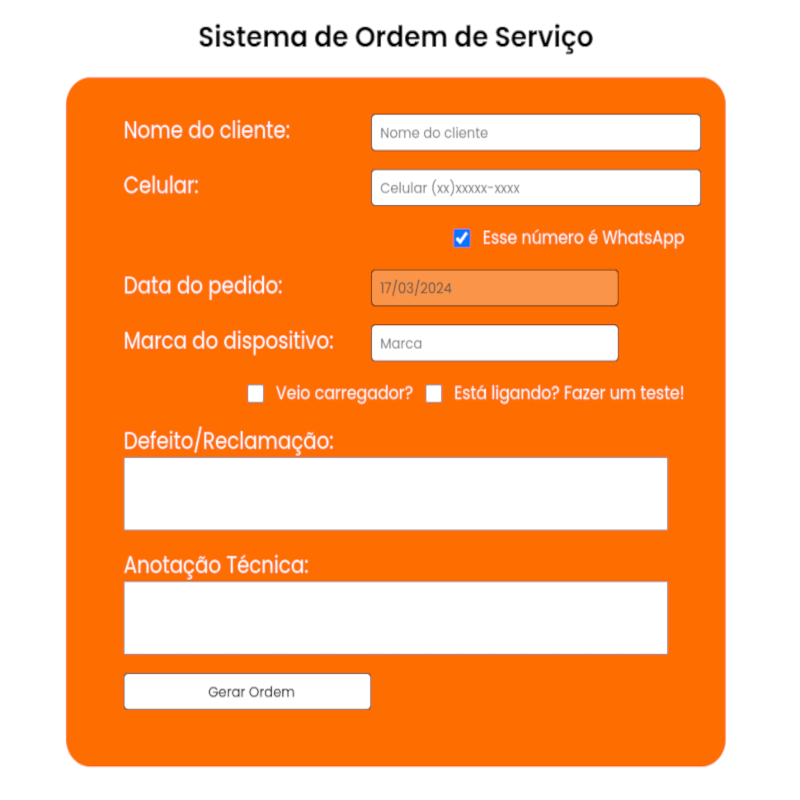

# Sistema Ordem Serviço
## ! This project has a documentation in Portuguese Brazil

## Preview

## O que é esse projeto?
O sistema ele é um gerador de ordem de serviço voltado para manutenção de computadores,
assim que você inicia o projeto recebe um formulário que preenchido vai entregar uma 
visualização do que foi preenchido para que consiga gerar um pdf e imprimir ou utilizar digitalmente.

## Para que foi desenvolvido o projeto?
Esse projeto foi desenvolvido para melhorar minhas habilidade de em HTML, CSS e JavaScript
eu pensei alguma maneira de levar o meu conhecimento para entregar valor ao mundo real resolvendo
um problema que tenho no dia a dia que é digitar a mão as ordens de serviço como trabalho como 
técnico de informática.

## Tecnologias utilizadas
- HTML - Estrutura do Texto
- CSS - Estilização da Página
- JavaScript - Toda a interatividade da página e geração do pdf.
- html2pdf - Biblioteca que permite a geração do pdf atráves do Javascript.

